# 线段 v2.0 划分规则说明

> 来源：`docs/线段v2.0.pdf`。该 PDF 只有 1 页，内容为一张长图，无可抽取文字层；本文依据原图逐段核对后整理。本文目标是把 PDF 中的线段划分规则转成可用于 Python 实现的算法手册。

## 1. 基础层级

### 1.1 从 K 线到笔

将 K 线进行归纳组合，可以得到四种 K 线组合形态：

- 顶分型
- 底分型
- 上升 K 线
- 下降 K 线

继续将这些 K 线组合形态进行归纳组合，可以得到“笔”。

### 1.2 笔的定义

相邻的顶分型和底分型之间，如果至少有一根独立 K 线不被顶分型区间和底分型区间所包含，则顶和底之间称为一笔。
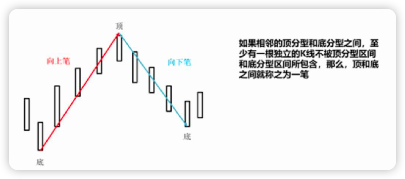

注意：

- 必须是相邻的顶和底。
- 顶和底之间可以忽略其他波动。
- 如果两个分型之间隔了多个分型，就不能直接称为一笔。
- 一笔必须满足独立 K 线条件，即顶分型区间和底分型区间之间至少有一根独立 K 线。

### 1.3 从笔到线段

分型是对 K 线的第一步归纳处理，笔是对 K 线的进一步归纳处理，线段是对笔的进一步归纳处理。

在实际应用中，笔的变化过于频繁。如果把笔作为趋势转折的判断标准，或者把笔作为中枢的最小构造零件，容易造成趋势转折判断频繁且容易误判。因此引入线段，以提高走势结构的稳定性。

## 2. 线段的基本定义

### 2.1 线段的最小构成

线段至少由三笔构成。

线段中任何相邻两笔方向必定相反。例如：

- 如果线段开始笔为向上笔，则第二笔必定是向下笔，第三笔又是向上笔。
- 如果三笔之后线段还未结束，则第四笔必定又是向下笔，以此类推。
- 如果线段开始笔为向下笔，则方向顺序反过来。

### 2.2 线段的基本形态

线段与笔类似，相邻线段方向也必须相反。

向上笔开始的线段，必定也结束于向上笔:

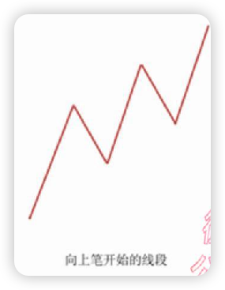

向下笔开始的线段，必定也结束于向下笔:

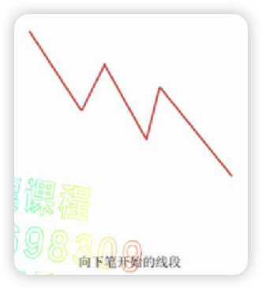

因此：

- 向上线段结束后，后面必定是向下线段。
- 向下线段结束后，后面必定是向上线段。
- 向上线段必定开始于底分型。
- 向下线段必定开始于顶分型。
- 如果划出的线段起点和终点不是底分型与顶分型的对应关系，划分一定有误。

### 2.3 起点和终点约束

线段当前的开始位置，必定是前一线段的结束位置。

因此，判断当前线段的开始与结束，本质上是判断当前线段何时结束。

线段结束与线段内反方向笔的回拉力度密切相关。以向上线段为例：

- 线段内向上笔决定向上线段的力度和空间。
- 线段内向下笔代表向上线段受到的阻力，决定向上线段能走多远。
- 判断向上线段是否结束，需要观察线段内向下笔构成的特征序列。

向下线段反过来：

- 判断向下线段是否结束，需要观察线段内向上笔构成的特征序列。

## 3. 特征序列

### 3.1 特征序列的定义

为了更直观地理解线段，可以把线段中的反方向笔抽象成特征序列。特征序列类似分型处理中的 K 线序列。

处理方法：

- 判断向上线段是否结束时，将该向上线段内的每一个向下笔的高低点作为特征序列元素。
- 判断向下线段是否结束时，将该向下线段内的每一个向上笔的高低点作为特征序列元素。
- 然后像处理 K 线组合一样，对特征序列进行包含关系处理和顶底分型识别。

如果特征序列出现顶分型或底分型，就可以据此判断当前线段是否结束。
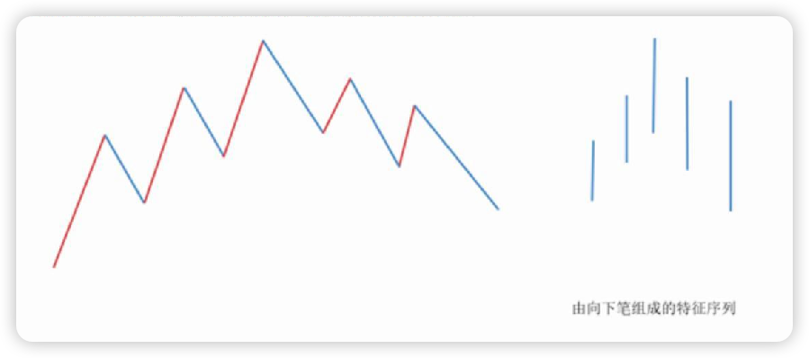

### 3.2 当前线段与后续走势的关系

观察当前线段是否结束时，需要把当前线段内的反方向笔当作特征序列。

在还没有确认当前线段结束之前，当前线段高点或低点右侧的走势，仍可暂时视为当前线段的一部分。

例如：

- 判断左侧向上线段是否结束时，右侧向下走势仍然把向下笔作为左侧向上线段的特征序列，而不是直接当成新的向下线段。
- 只有左侧向上线段被确认结束后，右侧走势才可正式作为向下线段。
- 反过来，判断右侧向下线段是否结束时，则应把该向下线段内的向上笔作为特征序列。

### 3.3 特征序列包含关系

特征序列元素之间处理分型时也会遇到包含关系，但与 K 线分型的包含处理不同。

在标准线段判定中：

- 如果特征序列是左边元素包含右边元素，需要进行包含关系处理。
- 如果特征序列是右边元素包含左边元素，不能进行包含关系处理。

也可以概括为：特征序列第一元素和第二元素不能做向左包含处理，顶或底两侧的特征序列不能随意包含处理。
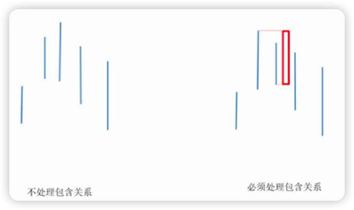

在后文复杂线段中，PDF 又强调了低级别复杂情形下的包含处理差异：

- 反向线段的特征序列处理包含关系时允许向左包含。
- 但第一元素和第二原始元素之间只能向右包含，不能向左包含。
- 第二元素右侧的特征序列元素之间，既可以向左包含，也可以向右包含。

实现时应区分标准情况与复杂情况，不能简单复用普通 K 线包含规则。

## 4. 线段的破坏与结束

根据特征序列第一元素和第二元素之间有没有缺口，分两种情况判定当前线段是否结束。

这里的“缺口”指特征序列第一元素与第二元素的价格区间没有重叠：

- 向上线段的特征序列由向下笔构成，若前两个向下笔区间不重叠，则存在缺口。
- 向下线段的特征序列由向上笔构成，若前两个向上笔区间不重叠，则存在缺口。

### 4.1 情况一：特征序列第一元素和第二元素之间无缺口

如果第一元素和第二元素之间不存在缺口，并且特征序列经过包含关系处理后形成对应分型，则当前线段结束。

向上线段：

- 当前向上线段的特征序列如果形成顶分型结构，则向上线段在该顶分型高点处结束。
- 该顶分型高点就是当前向上线段的终点。
  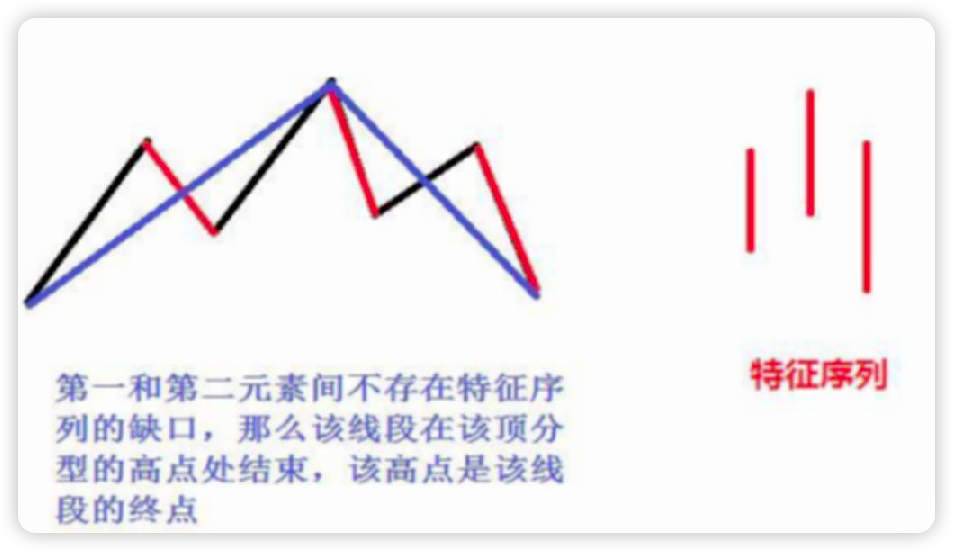

向下线段：

- 当前向下线段的特征序列如果形成底分型结构，则向下线段在该底分型低点处结束。
- 该底分型低点就是当前向下线段的终点。

### 4.2 情况二：特征序列第一元素和第二元素之间有缺口

如果特征序列的顶分型或底分型中，第一元素和第二元素之间存在缺口，则不能直接按当前分型结束线段，需要进一步确认。

向上线段中的处理：

- 特征序列出现顶分型。
- 第一元素和第二元素之间有缺口。
- 从该顶分型最高点开始的下一笔向下笔开始，重新构造一个新的特征序列。
- 如果这个新特征序列出现底分型，则原向上线段在该顶分型的高点处结束。
- 该高点是原向上线段的终点。
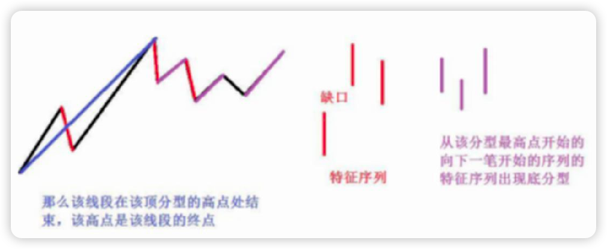
向下线段中的处理：

- 特征序列出现底分型。
- 第一元素和第二元素之间有缺口。
- 从该底分型最低点开始的下一笔向上笔开始，重新构造一个新的特征序列。
- 如果这个新特征序列出现顶分型，则原向下线段在该底分型的低点处结束。
- 该低点是原向下线段的终点。

### 4.3 情况二的重要补充

在第二种情况下，后一特征序列不一定封闭前一特征序列对应的缺口。

也就是说：

- 有缺口时，不需要回补缺口。
- 关键是第二个特征序列中要出现分型。
- 第二个特征序列中的分型，不再区分是情况一还是情况二。
- 只要第二个特征序列有分型即可确认。
- 此时不需要再考虑这个特征序列本身有没有缺口。
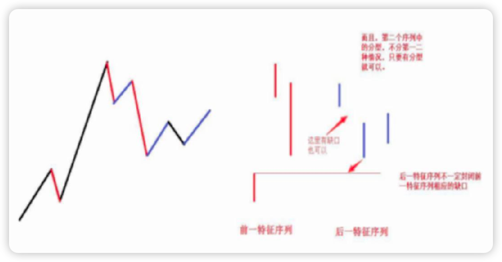
这一结论来自缠中说禅线段分解定理：线段只能被另一个线段所破坏。

## 5. 标准线段划分准则

上述两种情况给出了标准线段划分的全部基本标准。

核心结论：

- 出现特征序列分型，是线段结束的前提条件。
- 若特征序列第一元素和第二元素之间无缺口，分型成立即可确认结束。
- 若特征序列第一元素和第二元素之间有缺口，需要从分型极值点之后重新构造反向特征序列，并等待该新特征序列出现反向分型。
- 之后所有线段划分，都以这些精确定义为基础。

## 6. 复杂线段处理

在 `30min` 及以上级别，线段结构比较稳定，模式比较单一，上述两种标准情况基本可以解决 `99%` 的线段划分问题。

但在低级别走势中，走势变化频率较高，线段结构有时更复杂，不能简单套用上述两种标准情况，于是产生复杂线段划分问题。

### 6.1 复杂线段一

图示含义：

- 前一特征序列有顶分型。
- 后一特征序列因为元素之间存在包含关系，底分型不成立。
- 因此图中从起点到最后只有一段，而不是三段。
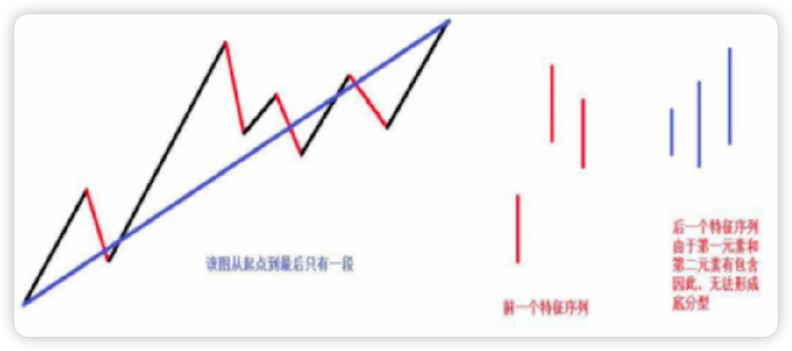
包含处理提醒：

- 反向线段的特征序列在处理包含关系时有所不同。
- 此时允许向左包含。
- 图示中第一元素和第二原始元素之间只能向右包含。
- 第二元素右侧的特征序列元素之间，既可向左包含，也可向右包含。

算法含义：

- 不能只看到前一特征序列出现顶分型就立即拆分出多个线段。
- 如果后续特征序列因为包含关系无法形成有效底分型，则不能确认反向线段成立。
- 整体仍应视为一段延续。

### 6.2 复杂线段二：原上涨段结束，下跌段形成

图示编号关系：
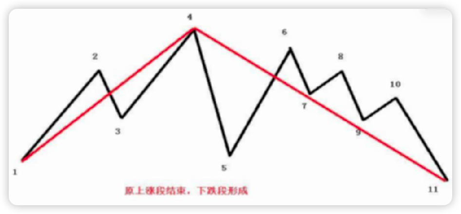
- `4-5` 这一笔力度太大。
- 之后的 `5-6`、`6-7` 两笔都在 `4-5` 笔范围内波动。
- `4-7` 三笔没有形成线段。
- 因此无法判断方向，也没有特征序列。
- 从 `1` 开始的线段也暂时无法判断有没有结束。
- 直到最终 `10-11` 笔跌破 `5` 的低点，才最终确认 `4-11` 的 `7` 笔为向下线段。
- 同时确认 `1-4` 线段结束。
- `4` 为 `1-4` 线段的最高点。

算法含义：

- 强反向笔之后，如果后续几笔仍在该强反向笔范围内震荡，并没有形成至少三笔的新线段，则只能视为中间状态。
- 必须等待后续笔突破关键低点或高点，确认一个方向明确的新线段。
- 对上涨段而言，跌破关键低点后，才能确认原上涨段已经结束，并确认后面的下跌线段。

### 6.3 复杂线段三：原上涨段延续

图示编号关系：
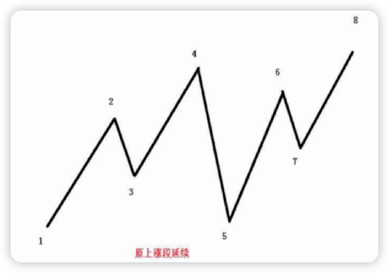
- `4-5` 这一笔力度太大。
- 之后的 `5-6`、`6-7` 两笔都在 `4-5` 笔范围内波动。
- `4-7` 三笔没有形成线段。
- 因此无法判断方向，也没有特征序列。
- 从 `1` 开始的线段也暂时无法判断有没有结束。
- 直到最终 `7-8` 笔升破 `4` 的高点，才最终确认 `1-4` 线段延续到 `8`。
- 即 `1-8` 仍然是一个线段。

算法含义：

- 如果强反向笔之后，后续走势没有形成有效反向线段，而是重新突破原线段极值，则原线段延续。
- 这种情况下不能提前把 `1-4` 与后续走势切开。

### 6.4 复杂线段四：中间状态、包含处理与突破确认

图示编号关系：
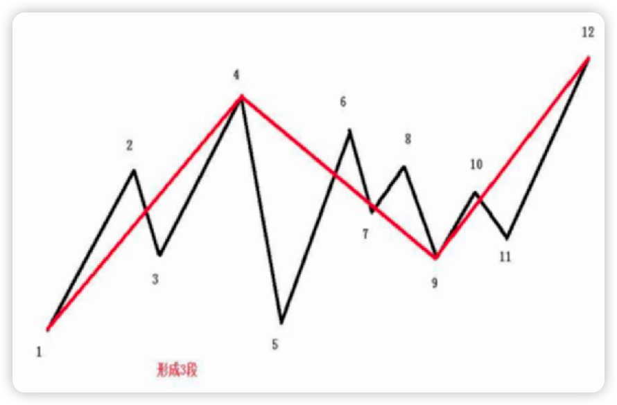
- `4-5` 笔破坏原线段。
- 之后的 `6-7`、`8-9`、`10-11` 都在 `4-5` 这一笔范围内。
- 因此 `4-5`、`6-7`、`8-9`、`10-11` 都只能算中间状态。
- `2-3` 明显属于原来的上涨段。
- 虽然 `4-5` 包含了 `2-3`，但不能对 `4-5` 与 `2-3` 做包含处理。

原因：

- 特征序列第一元素和第二元素只能向右包含，不能向左包含。
- 因此不能把 `4-5` 向左包含掉 `2-3`。
- 能做包含处理的只能是 `4-5` 与后面的 `6-7`、`8-9`。

具体处理：

- `4-5` 与 `6-7` 做包含处理。
- 根据高高原则，新的笔为 `4-7`。
- `8-9` 又破坏这个包含处理后的笔。
- 此时上涨段的特征序列出现顶分型：`2-3`、`4-7`、`8-9`。
- 但是由于 `9` 没有破 `5` 的低点，`10` 也没有破 `4` 的高点，`4-11` 仍然属于一个中间状态。
- 直到 `12` 点出现，向上突破 `4` 的高点，才首先确认 `2-3`、`4-7`、`8-9` 这个特征序列的顶分型。
- 又因为 `9-10` 笔破坏了 `4-9` 这段，`11-12` 升破了 `10` 点，形成向上的一段。
- 因此，`4-9` 可以确定为下跌段，`9-12` 是上涨段。

特殊分支：

- 如果 `10` 点直接突破 `4`，则 `9-10` 只有一笔。
- 此时中间状态也结束。
- 但 `2-3`、`4-7`、`8-9` 这个顶分型不成立。
- 因此 `1-10` 只是一段。
- 后面的特征序列顶分型从 `10` 开始。

算法含义：

- 中间状态不能强行判定线段。
- 对包含关系必须限制方向。
- 关键突破点不同，会改变前面特征序列是否成立。
- 不能只看一笔突破，需要判断是否形成了能破坏旧线段的新线段。

### 6.5 复杂线段五：同一结构的三种处理路径
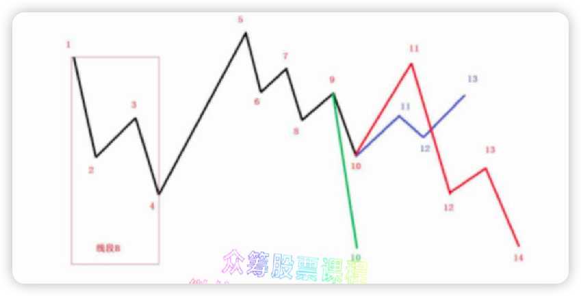
图中 `1-4` 是向下的线段 `B`，`4-5` 是一笔破坏。后续出现三种情况。

#### 6.5.1 情况一：绿色线段

规则描述：

- `1-4` 是向下的线段 `B`。
- `4-5` 是一笔破坏。
- `5` 点后面又走出下跌线段。
- 最终跌破 `4` 点。
- 此时仍然是线段 `B` 的延续。
- `1-10` 是一段。

算法含义：

- 一笔破坏后，如果后续重新形成同向下跌并跌破原关键点，则原下跌线段延续。
- 不能因为 `4-5` 单笔反弹就确认线段 `B` 结束。

#### 6.5.2 情况二：红色线段

规则描述：

- `1-4` 是向下的线段 `B`。
- `4-5` 是一笔破坏。
- `10` 点没有破 `4` 点。
- 后面有一笔反弹，且反弹高于上一个向上笔 `9` 点。
- 然后走势又继续下跌，并最终跌破 `4` 点。

争议点：

- 对于下跌线段 `B` 的特征序列，`4-5`、`6-7`、`8-9` 可以经过包含处理得到 `4-9`。
- 由于 `11` 点高于 `9` 点，`2-3`、`4-9`、`10-11` 构成 `B` 的特征序列底分型。
- 从这个角度看，线段 `B` 结束，`4-11` 形成上涨线段，`11-14` 又是下跌线段。

但 PDF 给出的最终原则是：

- 如果从“线段必须被线段破坏”这个定义来看，`10-11` 只是对 `5-10` 的笔破坏。
- 后面 `12` 点跌破 `10` 点和 `4` 点，仍然是 `5-10` 这个下跌线段的延续。
- `4-5` 只是一笔破坏 `1-4` 这个线段 `B`。
- 因此 `5-14` 仍是 `1-4` 线段 `B` 的延续。
- 所以 `1-14` 应该是一段。

算法含义：

- 遇到特征序列分型与“线段必须被线段破坏”产生冲突时，应以“线段必须被线段破坏”为优先原则。
- 一笔破坏不等于线段破坏。
- 必须确认反向走势本身已经形成线段，才可以破坏前线段。

#### 6.5.3 情况三：蓝色线段

规则描述：

- `1-4` 是向下的线段 `B`。
- `4-5` 是一笔破坏。
- 从 `10` 点起来的线段破坏了 `5-10` 这个下跌线段。
- 由于 `10-13` 已经破坏了 `5-10`，因此 `10-13` 必然是一个向上线段。
- 无论此时 `13` 点是否高于 `5` 点，都属于线段破坏，符合定义。
- 因此此时的划分为：`1-4` 是一个下跌线段，`4-13` 是一个上涨线段。

算法含义：

- 如果反向走势已经形成线段，并破坏了前一同向段，则可以确认线段转换。
- 是否突破更远处的旧极值，不是唯一条件；关键是是否形成了线段级别的破坏。

## 7. 线段划分总结

PDF 最后给出的总结规则如下。

1. 特征序列第一元素和第二元素不能做包含处理，也就是顶或底两侧特征序列不能包含处理。
2. 判断线段是否结束，首先判断属于情况一还是情况二。
3. 同一线段中，两端的一顶一底，顶肯定要高于底。如果划出一个不符合这个基本要求的线段，划分一定有误。
4. 线段的破坏可以逆时间传递。也就是说，被后线段破坏的线段，一定破坏前线段。如果违反这个原则，线段划分一定有问题。

## 8 核心校验规则

每次生成或调整线段后，至少做以下校验：

- 每个线段至少包含三笔，除非当前线段仍在未完成状态。
- 相邻笔方向必须相反。
- 相邻线段方向必须相反。
- 向上线段必须从底分型开始，到顶分型结束。
- 向下线段必须从顶分型开始，到底分型结束。
- 同一线段两端的一顶一底中，顶必须高于底。
- 被后线段破坏的线段，必须已经破坏前线段，满足破坏的逆时间传递原则。
- 不能把一笔破坏误判成线段破坏。

## 9. 实现注意事项

### 9.1 不要提前确认线段

在复杂结构中，特征序列可能短暂出现疑似分型，但如果后续不能形成反向线段破坏，就不能确认原线段结束。

### 9.2 不要忽略缺口分支

情况一和情况二的差异是线段结束判定的关键。

尤其在有缺口时：

- 不能直接确认线段结束。
- 必须等待第二特征序列出现反向分型。
- 第二特征序列不要求回补缺口。
- 第二特征序列自身不再区分有缺口还是无缺口。

### 9.3 不要用普通 K 线包含规则替代特征序列包含规则

特征序列的包含处理比 K 线包含更受限制，尤其是第一元素和第二元素，以及顶底两侧元素的包含处理限制。

### 9.4 保留待定状态
低级别走势中，很多形态需要等后续笔确认。算法应允许输出待定或中间状态，而不是强行实时切分。

